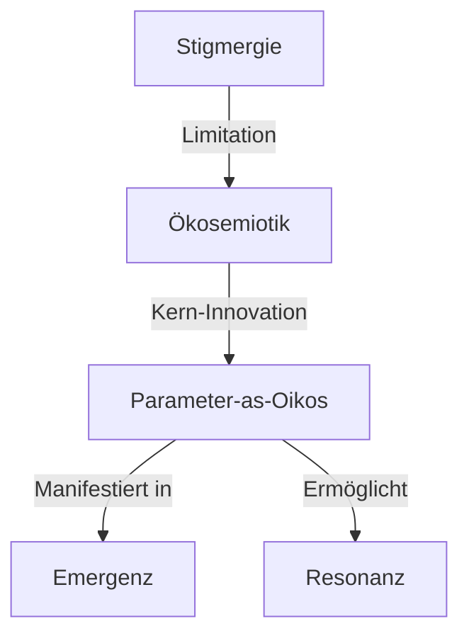

# Map of Content: Theoretical Framework

**Zentrale MOC für die theoretischen Grundlagen der Ökosemiotik**

Diese Map verbindet die 5 Kern-Konzepte und zeigt ihre theoretischen Beziehungen.

---

## Theoretische Entwicklung: Von Stigmergie zu Ökosemiotik

### Historische Linie

```yaml
1959: Grassé - Stigmergie bei Termiten
  ↓
1992: Ant Colony Optimization (ACO)
  ↓
2010: Digital Stigmergy (Multi-Agent Systems)
  ↓
2024: Ökosemiotik (Parameter-as-Oikos)
```

### Die Ökosemiotische Wende



---

## 5 Kern-Konzepte & Ihre Beziehungen

### 1. [[../concepts/stigmergy.md|Stigmergie]] (Foundation)

```yaml
Definition: Koordination durch Zeichen/Spuren

Rolle im Framework:
  - Historische Grundlage
  - "Klassisches Modell" (M1)
  - Ausgangspunkt für Kritik

Limitation:
  - Parameter als "Settings" (passiv)
  - Speicher-Metapher (Information → Retrieval)
  - Keine Inter-System-Dynamik
```

**→ Führt zu:** [[../concepts/oekosemiotik.md|Ökosemiotik]]

### 2. [[../concepts/oekosemiotik.md|Ökosemiotik]] ⭐ (Paradigm Shift)

```yaml
Definition: Die ökosemiotische Wende

Drei fundamentale Verschiebungen:

1. Speicher → Ko-Konstitution
   - Trails sind nicht "Information"
   - Trails sind "ko-konstituierende Umwelten"

2. Information → Handlungsparameter-Veränderung
   - Nicht: "Agent liest Information"
   - Sondern: "Agent-Umwelt modifiziert Handlungsparameter"

3. Variablen → Oikos
   - Parameter sind nicht "Einstellungen"
   - Parameter sind "strukturierende Umwelten"

Theoretische Innovation:
  - Oikos statt Stigma
  - Parameter-Räume als Umwelt-Dimensionen
  - Multi-System-Resonanz
```

**→ Implementiert durch:** [[../concepts/parameter-as-oikos.md|Parameter-as-Oikos]]

### 3. [[../concepts/parameter-as-oikos.md|Parameter-as-Oikos]] ⭐ (Core Innovation)

```yaml
Definition: Parameter als aktive ko-konstituierende Umwelten

Vier Parameter-Oikos-Dimensionen:

1. Physikalische Oikos:
   - Gedächtnis, Raum, Grenzen
   - Parameter: decay, diffusion, fade, saturation

2. Semiotische Oikos:
   - Wahrnehmung, Zeichensetzung
   - Parameter: sensor-distance, sensor-angle, deposit, turn-speed

3. Temporale Oikos:
   - Zeit, Geschwindigkeit, Störung
   - Parameter: speed, agent-count, chaos-interval, chaos-strength

4. Resonanz-Oikos:
   - Inter-System-Beziehungen
   - Parameter: attraction, repulsion, cross-species-interaction

Theoretische Bedeutung:
  - Von "Settings" zu "Structuring Forces"
  - Parameter ko-konstituieren Möglichkeitsräume
  - Emergenz ist parameter-abhängig
```

**→ Manifestiert sich als:** [[../concepts/emergenz.md|Emergenz]]

### 4. [[../concepts/emergenz.md|Emergenz]] (Phenomenon)

```yaml
Definition: Selbstorganisation in ökosemiotischen Systemen

Drei Emergente Eigenschaft-Familien:

1. Ordnungs-Eigenschaften:
   - [[../properties/crystallinity.md]]: Geometrische Muster
   - [[../properties/density.md]]: Hotspot-Konzentration

2. Dynamische Eigenschaften:
   - [[../properties/stability.md]]: Zeitliche Persistenz
   - [[../properties/fluidity.md]]: Organisches Morphing
   - [[../properties/chaos.md]]: Irregularität

3. Soziale Struktur:
   - [[../properties/cluster-formation.md]]: Selbst-Resonanz
   - [[../properties/separation.md]]: Inter-System-Grenzen
   - [[../properties/network.md]]: Verzweigte Verbindungen

Emergente Irreversibilität:
  - Akkumulation erzeugt persistente Strukturen
  - Schwellenwerte (Decay ~0.935, Repulsion ~-0.5)
  - Nichtlineare Phasenübergänge
```

**→ Ermöglicht:** [[../concepts/resonanz.md|Resonanz]]

### 5. [[../concepts/resonanz.md|Resonanz]] (Multi-System Dynamics)

```yaml
Definition: Affektive Beziehungen zwischen Zeichensystemen

Zwei Resonanz-Modi:

1. Selbst-Resonanz (Attraction):
   - Agents folgen eigenen Spuren
   - Clusterbildung
   - Parameter: attractionStrength

2. Fremd-Resonanz (Repulsion):
   - Agents meiden fremde Spuren
   - Separation, Territorien
   - Parameter: repulsionStrength

Harmonie-Schwelle (~-0.5):
  - Unterhalb: Dissonanz (Segregation)
  - Oberhalb: Koexistenz (Harmonie)

Theoretische Bedeutung:
  - Verbindung zu Rosa's Resonanztheorie
  - Ökosemiotik als "Resonanz-Ökologie"
  - Inter-System-Kopplung (crossSpeciesInteraction toggle)
```

---

## Zentrale Thesen der Ökosemiotik

### These 1: Parameter als Oikos

```yaml
Klassische Sicht:
  Parameter = Einstellungen (passiv, neutral)

Ökosemiotische Sicht:
  Parameter = Ko-konstituierende Umwelten (aktiv, strukturierend)

Implikation:
  - Parameter-Wahl ist Umwelt-Gestaltung
  - Emergenz ist parameter-abhängig
  - "Design" = Oikos-Architektur
```

**Empirische Evidenz:**
- [[../parameters/decay-rate.md]]: Schwellenwert bei ~0.935 → qualitativ verschiedene Muster
- [[../parameters/repulsion-strength.md]]: Harmonie-Schwelle bei ~-0.5 → Segregation vs. Koexistenz

### These 2: Ko-Konstitution statt Speicher

```yaml
Klassische Sicht (Stigmergie):
  Trail = Informations-Speicher
  Agent = Information-Reader

Ökosemiotische Sicht:
  Trail = Ko-konstituierendes Medium
  Agent-Trail-Paar = Gekoppeltes System

Implikation:
  - Trails sind nicht "passiv"
  - Trails modifizieren Agent-Handlungsparameter
  - Bidirektionale Kopplung (Agent ↔ Trail)
```

**Empirische Evidenz:**
- [[../properties/stability.md#chaos-injection-paradox]]: Moderate Störung ERHÖHT Stabilität → nichtlineare Kopplung
- [[../meta/map-parameter-effects.md#parameter-interdependenzen]]: Decay × Diffusion Trade-off → Kopplung zwischen Oikos-Dimensionen

### These 3: Multi-System-Resonanz

```yaml
Klassische Sicht (Stigmergie):
  Multi-Spezies = Getrennte Systeme (parallel)

Ökosemiotische Sicht:
  Multi-Spezies = Gekoppelte Zeichen-Systeme (Resonanz)

Implikation:
  - crossSpeciesInteraction ist ontologischer Toggle
  - Repulsion schafft Inter-System-Grenzen
  - Separation ist emergente soziale Struktur

Nur in: RESONANZ-Modus (nicht MYZEL/STIGMERGIE)
```

**Empirische Evidenz:**
- [[../properties/separation.md]]: Erfordert repulsion < -0.5 + sensorDistance > 25 + crossSpeciesInteraction: true
- [[../experiments/mode-comparison.md]]: RESONANZ zeigt Segregation, STIGMERGIE nicht

---

## Theorie × Empirie: Verbindungen

### Konzepte → Parameter

```yaml
Konzept: [[../concepts/parameter-as-oikos.md#physikalische-oikos]]
→ Parameter: [[../parameters/decay-rate.md]], [[../parameters/diffusion.md]], [[../parameters/fade-strength.md]], [[../parameters/trail-saturation.md]]

Konzept: [[../concepts/resonanz.md]]
→ Parameter: [[../parameters/attraction-strength.md]], [[../parameters/repulsion-strength.md]], [[../parameters/cross-species-interaction.md]]
```

### Konzepte → Properties

```yaml
Konzept: [[../concepts/emergenz.md#emergente-irreversibilität]]
→ Property: [[../properties/stability.md]], [[../properties/crystallinity.md]]

Konzept: [[../concepts/resonanz.md#selbst-resonanz]]
→ Property: [[../properties/cluster-formation.md]]

Konzept: [[../concepts/resonanz.md#fremd-resonanz]]
→ Property: [[../properties/separation.md]]
```

### Konzepte → Experimental Methods

```yaml
Konzept: [[../concepts/parameter-as-oikos.md]]
→ Method: [[../methods/systematic-variation.md]] (isoliere Oikos-Effekte)

Konzept: [[../concepts/emergenz.md#schwellenwerte]]
→ Method: [[../methods/iterative-deepening.md]] (Schwellenwerte präzise lokalisieren)

Konzept: [[../concepts/oekosemiotik.md#ökosemiotische-wende]]
→ Experiment: [[../experiments/mode-comparison.md]] (empirische Validierung)
```

---

## Offene Forschungsfragen

### Theoretische Fragen

```yaml
1. Formalisierung von "Ko-Konstitution":
   - Kann man Ko-Konstitution mathematisch modellieren?
   - Kategorie-theoretische Perspektive?

2. Resonanz-Theorie-Verbindung:
   - Wie genau verbindet sich ökosemiotische Resonanz mit Rosa's Resonanztheorie?
   - Kann man "Harmonie-Schwellen" allgemein definieren?

3. Oikos-Dimensionen vollständig?:
   - Gibt es weitere Parameter-Oikos jenseits der 4?
   - Wie verhalten sich Oikos-Dimensionen zueinander?
```

### Empirische Fragen

```yaml
1. Schwellenwert-Präzisierung:
   - Decay ~0.935: Exakt genug? (siehe [[../methods/iterative-deepening.md]])
   - Repulsion ~-0.5: Gilt für alle Baselines?

2. Parameter-Interdependenzen:
   - Vollständige 2-Parameter-Grids für alle Kombinationen?
   - Gibt es 3+-Parameter-Effekte?

3. Modus-Vergleich:
   - Systematische Variation über alle Modi?
   - Welche Eigenschaften sind modus-invariant?
```

### Methodische Fragen

```yaml
1. Metriken-Implementierung:
   - [[../metrics/entropy-measurement.md]]: Implementieren & kalibrieren
   - [[../metrics/fractal-dimension.md]]: Box-Counting optimieren

2. Automatisierung:
   - Können experimentelle Workflows automatisiert werden?
   - ML-basierte Muster-Klassifikation?
```

---

## Verwandte MOCs

- **[[map-parameter-effects.md]]** ⭐⭐⭐ - Empirische Parameter × Property Matrix
- **[[map-experimental-methodology.md]]** ⭐⭐ - Methoden zur empirischen Validierung dieser Theorie

---

## Externe Ressourcen

### Primär-Dokument

- [[../../research/Von_Stigmergie_zu_Oekosemiotik.md]] - Ursprüngliches theoretisches Dokument (533 Zeilen, nicht-atomar)

### Verwandte Theorie-Dokumente

- [[../../research/parametrics_paper_draft.md]] - Akademisches Paper (lineare Narration)
- [[../../research/Research_Supplement_B-Computational_Model_Protoco.md]] - Pre-Registered Protocol

---

**Status**: Theoretisches Fundament - empirisch testbar! 🧠

⭐ = Zentrale Konzepte (Stigmergie, Ökosemiotik, Parameter-as-Oikos, Emergenz, Resonanz)
